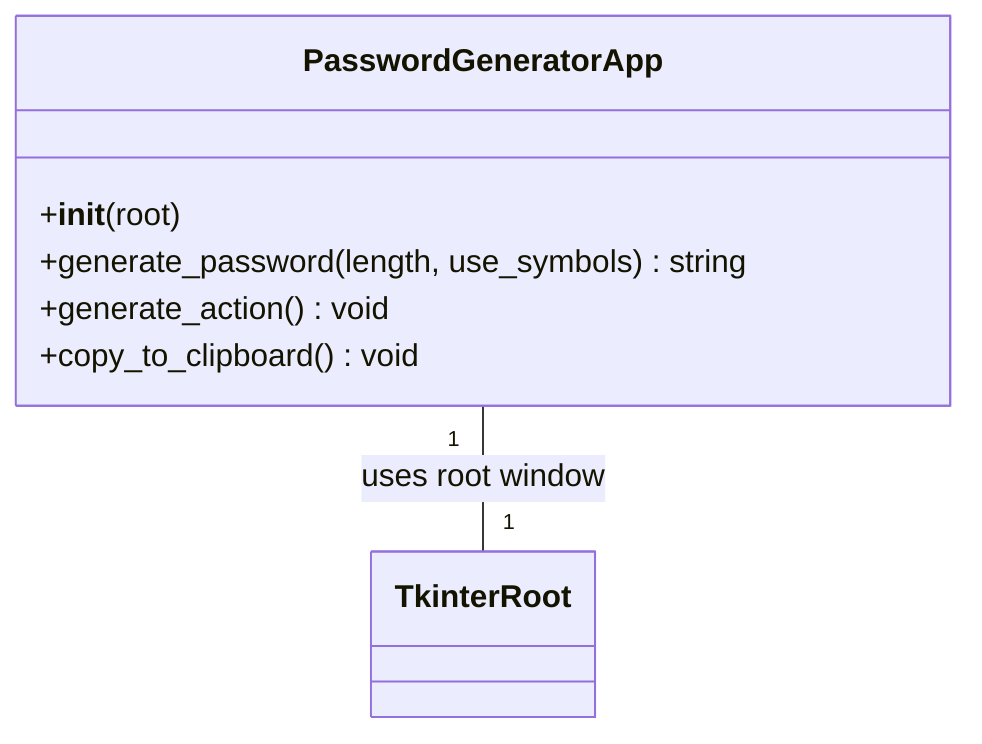
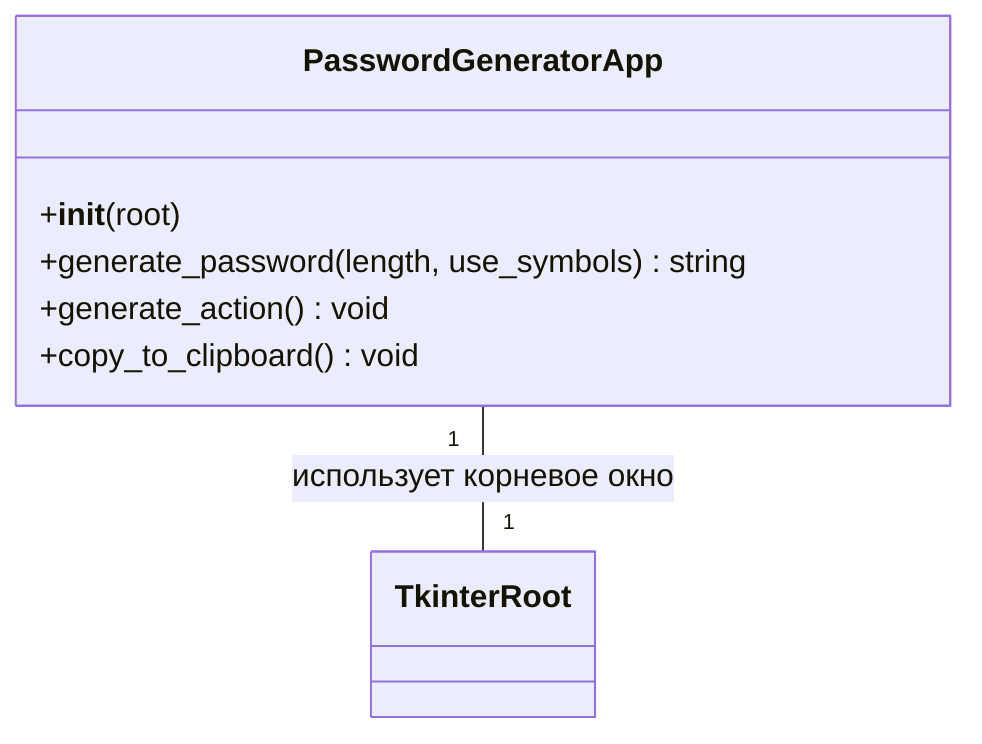

# 🔑 Python Password Generator

[](https://www.python.org/)
[](LICENCE)

A simple and secure password generator with a graphical interface based on [`Tkinter`](https://docs.python.org/3/library/tkinter.html). It allows you to create strong passwords with a specified length and include special characters for enhanced security.

---

## ✨ Features

- **Customizable Length:** Choose the desired password length for various security requirements.
- **Special Character Inclusion:** Optionally add special characters, numbers, and uppercase/lowercase letters.
- **Copy to Clipboard:** Quickly copy the generated password with a single click.
- **User-Friendly Interface:** Intuitive graphical interface for easy use.

---

## 🚀 Installation and Usage

### Requirements

- Python 3.x

### Instructions

1.  **Clone the repository:**

    ```bash
    git clone https://github.com/fokasssuins/python-generator-password.git
    cd python-generator-password
    ```

2.  **Run the application:**

    ```bash
    python python-generator-password.py
    ```

---

## 💡 Usage

After launching the application, you will see the password generator window:

_(Here could be a screenshot or GIF of the application in action)_

1.  **Click the "Generate Password" button.**
2.  **Enter the desired password length** in the corresponding field.
3.  **Confirm if you want to use special characters** by checking or unchecking the corresponding box.
4.  **The generated password will be displayed in the window.**
5.  **Click the "Copy" button** to copy the password to the clipboard and use it.

---

## 🛠️ Code Structure

The main application logic is implemented in the [`PasswordGeneratorApp`](python-generator-password.py:14) class.

The [`create_gui()`](python-generator-password.py:86) function initializes the Tkinter root window (`tk.Tk`) and creates an instance of the [`PasswordGeneratorApp`](python-generator-password.py:14) class, passing this root window to it. The `PasswordGeneratorApp` class is responsible for building the user interface, handling events, and generating passwords.



---

# 🔑 Генератор Паролей на Python

[](https://www.python.org/)
[](LICENCE)

Простой и безопасный генератор паролей с графическим интерфейсом на базе [`Tkinter`](https://docs.python.org/3/library/tkinter.html). Позволяет создавать надежные пароли с заданной длиной и включать специальные символы для повышения безопасности.

---

## ✨ Особенности

- **Настраиваемая длина:** Выбор желаемой длины пароля для различных требований безопасности.
- **Включение спецсимволов:** Опциональное добавление специальных символов, цифр и букв в верхнем/нижнем регистре.
- **Копирование в буфер обмена:** Быстрое копирование сгенерированного пароля одним кликом.
- **Удобный интерфейс:** Интуитивно понятный графический интерфейс для легкого использования.

---

## 🚀 Установка и Запуск

### Требования

- Python 3.x

### Инструкции

1.  **Клонируйте репозиторий:**

    ```bash
    git clone https://github.com/fokasssuins/python-generator-password.git
    cd python-generator-password
    ```

2.  **Запустите приложение:**

    ```bash
    python python-generator-password.py
    ```

---

## 💡 Использование

После запуска приложения вы увидите окно генератора паролей:

_(Здесь может быть скриншот или GIF-файл работы приложения)_

1.  **Нажмите кнопку "Генерировать пароль".**
2.  **Введите желаемую длину пароля** в соответствующее поле.
3.  **Подтвердите, хотите ли вы использовать специальные символы**, установив или сняв соответствующий флажок.
4.  **Сгенерированный пароль отобразится в окне.**
5.  **Нажмите кнопку "Копировать"**, чтобы скопировать пароль в буфер обмена и использовать его.

---

## 🛠️ Структура Кода

Основная логика приложения реализована в классе [`PasswordGeneratorApp`](python-generator-password.py:14).

Функция [`create_gui()`](python-generator-password.py:86) инициализирует корневое окно Tkinter (`tk.Tk`) и создает экземпляр класса [`PasswordGeneratorApp`](python-generator-password.py:14), передавая ему это корневое окно. Класс `PasswordGeneratorApp` отвечает за построение пользовательского интерфейса, обработку событий и генерацию паролей.



---
