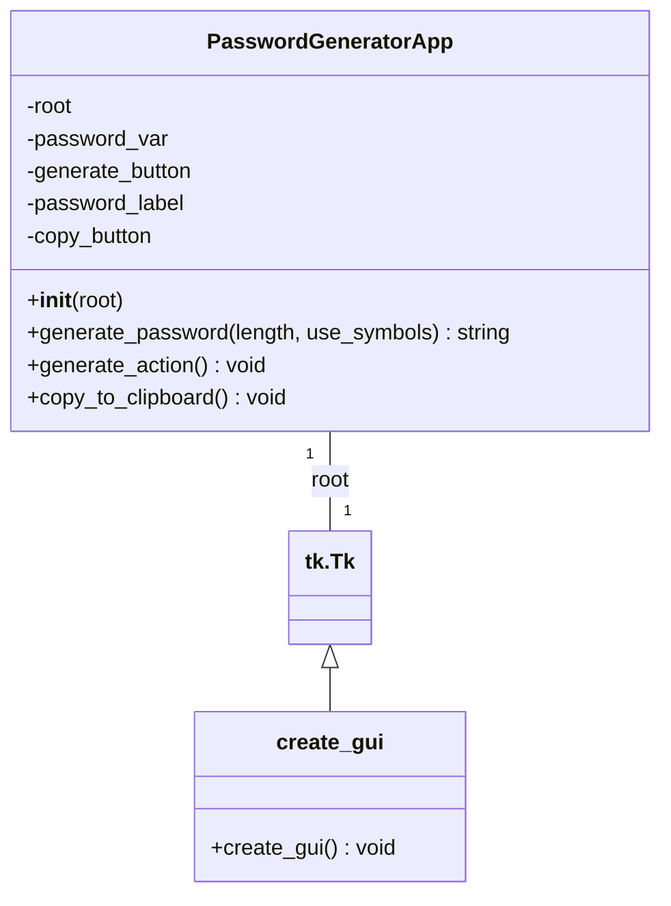

# Генератор паролей на Python

## Описание

Этот скрипт реализует простой генератор паролей с графическим интерфейсом на базе [`tkinter`](https://docs.python.org/3/library/tkinter.html). Пользователь может указать желаемую длину пароля и решить, включать ли специальные символы. Сгенерированный пароль отображается в окне приложения и может быть скопирован в буфер обмена.

## Основные компоненты и принципы работы

1.  **Глобальные константы**: Определены строковые константы [`UPPERCASE`](python-generator-password.py:7), [`LOWERCASE`](python-generator-password.py:8), [`DIGITS`](python-generator-password.py:9), [`SYMBOLS`](python-generator-password.py:10), содержащие наборы символов для генерации паролей.

2.  **Класс [`PasswordGeneratorApp`](python-generator-password.py:14)**:

    - **Назначение**: Основной класс, управляющий логикой приложения и пользовательским интерфейсом.
    - **Методы**:
      - [`__init__(self, root)`](python-generator-password.py:15): Конструктор, который инициализирует окно [`Tkinter`](https://docs.python.org/3/library/tkinter.html) (root), устанавливает заголовок, размер и создает все элементы GUI (кнопки, метки). Также инициализирует [`self.password_var`](python-generator-password.py:20) для хранения и отображения пароля.
      - [`generate_password(self, length, use_symbols)`](python-generator-password.py:40): Генерирует случайный пароль заданной длины. Гарантирует включение как минимум одной заглавной буквы, одной строчной буквы и одной цифры. При необходимости добавляет один специальный символ. Остальные символы выбираются случайным образом.
      - [`generate_action(self)`](python-generator-password.py:60): Обработчик события нажатия кнопки "Генерировать пароль". Запрашивает у пользователя длину и необходимость использования специальных символов, затем вызывает [`generate_password()`](python-generator-password.py:40) и обновляет отображаемый пароль, а также активирует кнопку "Copy".
      - [`copy_to_clipboard(self)`](python-generator-password.py:70): Обработчик события нажатия кнопки "Copy". Копирует текущий отображаемый пароль в буфер обмена и выводит информационное сообщение.

3.  **Функция [`create_gui()`](python-generator-password.py:74)**:

    - **Назначение**: Создает главное окно [`Tkinter`](https://docs.python.org/3/library/tkinter.html) и экземпляр класса [`PasswordGeneratorApp`](python-generator-password.py:14), запуская основной цикл обработки событий GUI (mainloop).

4.  **Блок `if __name__ == '__main__':`**:
    - **Назначение**: Стандартная точка входа в Python-скрипт, которая вызывает [`create_gui()`](python-generator-password.py:74) для запуска приложения, когда скрипт выполняется напрямую.

## Как использовать

Для запуска приложения выполните следующий скрипт Python:

```bash
python python-generator-password.py
```

После запуска появится окно приложения. Нажмите кнопку "Генерировать пароль", чтобы начать процесс генерации. Вам будет предложено ввести желаемую длину пароля и выбрать, использовать ли специальные символы. Сгенерированный пароль отобразится в окне, и вы сможете скопировать его в буфер обмена, нажав кнопку "Copy".

## Структура кода



---

# Python Password Generator

## Description

This script implements a simple password generator with a graphical user interface based on [`tkinter`](https://docs.python.org/3/library/tkinter.html). The user can specify the desired password length and decide whether to include special characters. The generated password is displayed in the application window and can be copied to the clipboard.

## Key Components and Principles of Operation

1.  **Global Constants**: String constants [`UPPERCASE`](python-generator-password.py:7), [`LOWERCASE`](python-generator-password.py:8), [`DIGITS`](python-generator-password.py:9), [`SYMBOLS`](python-generator-password.py:10) are defined, containing character sets for password generation.

2.  **[`PasswordGeneratorApp`](python-generator-password.py:14) Class**:

    - **Purpose**: The main class that manages the application logic and user interface.
    - **Methods**:
      - [`__init__(self, root)`](python-generator-password.py:15): Constructor that initializes the [`Tkinter`](https://docs.python.org/3/library/tkinter.html) window (root), sets the title, size, and creates all GUI elements (buttons, labels). It also initializes [`self.password_var`](python-generator-password.py:20) for storing and displaying the password.
      - [`generate_password(self, length, use_symbols)`](python-generator-password.py:40): Generates a random password of the specified length. Ensures the inclusion of at least one uppercase letter, one lowercase letter, and one digit. Optionally adds one special character if `use_symbols` is true. The remaining characters are chosen randomly.
      - [`generate_action(self)`](python-generator-password.py:60): Event handler for the "Generate Password" button click. Prompts the user for password length and whether to use special characters, then calls [`generate_password()`](python-generator-password.py:40) and updates the displayed password, as well as activating the "Copy" button.
      - [`copy_to_clipboard(self)`](python-generator-password.py:70): Event handler for the "Copy" button click. Copies the currently displayed password to the clipboard and shows an informational message.

3.  **[`create_gui()`](python-generator-password.py:74) Function**:

    - **Purpose**: Creates the main [`Tkinter`](https://docs.python.org/3/library/tkinter.html) window and an instance of the [`PasswordGeneratorApp`](python-generator-password.py:14) class, starting the main GUI event loop (mainloop).

4.  **`if __name__ == '__main__':` Block**:
    - **Purpose**: The standard entry point for a Python script, which calls [`create_gui()`](python-generator-password.py:74) to launch the application when the script is executed directly.

## How to Use

To run the application, execute the following Python script:

```bash
python python-generator-password.py
```

After launching, an application window will appear. Click the "Generate Password" button to start the generation process. You will be prompted to enter the desired password length and choose whether to use special characters. The generated password will be displayed in the window, and you can copy it to the clipboard by clicking the "Copy" button.

## Code Structure

````mermaid
classDiagram
    PasswordGeneratorApp "1" -- "1" tk.Tk : root
    PasswordGeneratorApp : +__init__(root)
    PasswordGeneratorApp : +generate_password(length, use_symbols) string
    PasswordGeneratorApp : +generate_action() void
    PasswordGeneratorApp : +copy_to_clipboard() void
    PasswordGeneratorApp : -root
    PasswordGeneratorApp : -password_var
    PasswordGeneratorApp : -generate_button
    PasswordGeneratorApp : -password_label
    PasswordGeneratorApp : -copy_button

    tk.Tk <|-- create_gui
    create_gui : +create_gui() void
```

